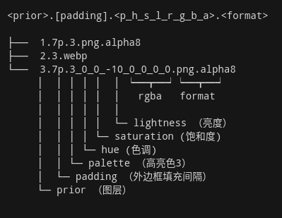
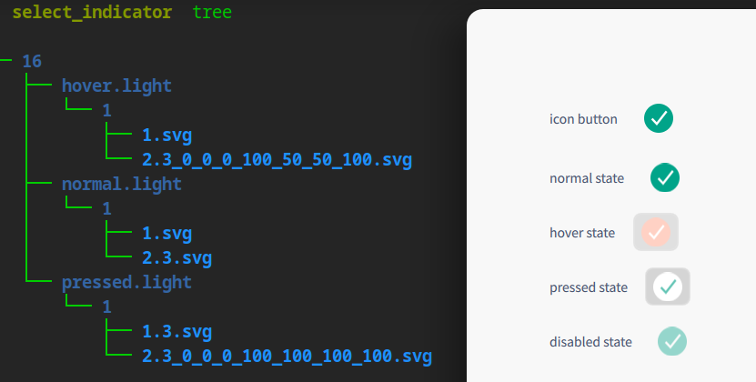

# 图标文件规范

> __警告！此规范内容是不稳定版本，可能会发生破坏兼容性的更新。当无法保障向下兼容时，将会升级此文档的主版本号，如从“1.0”更新到“2.0”。反之，普通更新只会升级次版本号，如“1.0”更新到“1.1”，其对“1.0”版本向下兼容。请在使用前确认此文档的版本号，并为将来可能发生的兼容性变化做好准备。__

* 维护者：zccrs zhangjide@uniontech.com
* 版本：1.1
* 修改日期：2022.11.21
* 议题：#5

## 引言

本规范约定了各类图标文件的内部数据格式要求，以及此类文件的使用规范。

## 归档打包<a name="package"></a>

dci 文件（以下简称为 dci）为一种归档打包格式，其规定了如何将多个图标文件合并为一个文件。

### 格式

* 格式名称：`dci`，为 DSG combined icons 的缩写
* mimetype：image/dci，继承自：application/octet-stream
* magic：DCI，类型为 string，offset 为 0
* 此类型对应的图标名：image-dci
* 后缀名：dci

对应的 mimetype 描述文件内容：关于 mimetype 规范的详细设计请查看 <http://www.freedesktop.org/standards/shared-mime-info>

```xml
<?xml version="1.0" encoding="UTF-8"?>
<mime-info xmlns="http://www.freedesktop.org/standards/shared-mime-info">
   <mime-type type="image/dci">
      <comment>DSG Icon file format</comment>
      <comment xml:lang="zh_CN">深度图标文件格式</comment>
      <glob pattern="*.dci"/>
      <icon name="image-dci"/>
      <magic priority="80">
        <match value="DCI" type="string" offset="0"/>
      </magic>
   </mime-type> 
</mime-info>

```

### 文件头

dci 使用小端序，文件的元数据位于文件开头。内容如下：

| 起始地址:结束地址 | 名称 | 大小 | 缺省值 |
| ---- | ---- | ---- | ---- |
| 0x0000:0x0003 | magic | 4B | DCI |
| 0x0004:0x0004 | 版本 | 1B |-|
| 0x0005:0x0007 | 文件数量 | 3B |-|
| 0x0008:0x0057 | 文件1元数据 | 72B |[格式](#file_format)|
| ... | 文件元数据 | - |[-](#file_format)|

> 这里的文件数量指根文件，不包含目录内的子文件。

> 文件顺序需按照其名称升序排列，此排列不区分文件类型。另外，需遵循[自然排序](http://www.naturalordersort.org/)（如“a2”在“a11”之前）规则。

### 文件的元数据 <a name="file_format"></a>

| 相对起始地址:相对结束地址 | 名称 | 大小 | 缺省值 |
| ---- | ---- | ---- | ---- |
| 0x0000:0x0000 | 文件类型 | 1B | [可选值](#file_type) |
| 0x0001:0x003F | 文件名 | 63B | - |
| 0x0040:0x0048 | 内容的大小 | 8B |-|
| 0x0049:0x???? | 内容 | - | - |

> 文件名为 UTF-8 编码，必须以 '\0' 结尾，且不可包含 '/' 字符。
>
> 目录的内容是：此目标内子目录以及文件的元数据和数据。

文件类型 <a name="file_type"></a>

| 值 | 类型 |
| ---- | ---- |
| 0 | 保留 |
| 1 | 文件 |
| 2 | 目录 |
| 3 | 链接 |

> 目录文件也属于文件类型的一种，可在目录下嵌套子目录。

> 目录内的文件顺序需按照其名称升序排列，此排列不区分文件类型。另外，需遵循英文环境（无国家要求）下的[自然排序](http://www.naturalordersort.org/)（如“a2”在“a11”之前）规则。

### 链接文件

链接的目标可以是“文件”或其它（不可链接自身）“链接”，否则认为此链接目标无效。创建链接时不检查链接的目标是否存在，对链接文件内容的读写操作等价于读写链接的目标，如若链接目标无效或不存在，则读写失败。获取链接的目标路径时，如果链接文件无效，需给出一个空路径。此外，需要提供方法以允许获取链接路径的原始数据。

链接文件的内容格式：

| 相对起始地址:相对结束地址 | 名称 | 大小 | 缺省值 |
| ---- | ---- | ---- | ---- |
| 0x0000:0x???? | 目标路径 | 取决于元数据中指定的内容大小 | - |

> 内容编码为 UTF-8，路径需符合 UNIX 标准，可使用相对路径。相对路径的 "." 和 ".." 仅可用于路径的开头，当"."、".."出现在路径中间时，如 "/./test.txt"、"../a/../"，此处的"."和".."需当作文件名称处理。

## 图标文件规范

在[归档打包](#package)中描述了 dci 文件的归档规范，本章节将描述 dci 格式的文件目录结构和命名规范。

### 图标状态

图标适应环境变化时所需要展现的不同形态，分为以下四种状态：

* normal：缺省状态
* disabled ：被禁用时的状态，一般表现为不再响应鼠标、键盘等输入事件
* hover：鼠标悬浮在图标上的状态
* pressed：点击后且未释放时的状态

> 当图标只提供 `normal` 状态的文件时，可使用一些固定规则对 `normal` 状态进行加工而得到其它状态，此规范不约束加工后的效果。

### 图标动画

如果对应状态的图片文件具有动画效果，如嵌入了动态的 webp 图片，则应当在图标状态变化时播放动画。动画播放需满足以下规则：

1. 初始化状态不自动播放动画，初始为 normal 状态时显示动画第一帧，其它状态显示动画的最后一帧；
2. normal 状态动态图的第一帧和最后一帧要等价，即内容完全相同；
3. 当从 normal 状态变为 hover 状态时，使用 1.0 倍速正序播放 hover 图片的动画，且停留到最后一帧；
4. 当从 hover 状态变为 pressed 状态时，使用 1.0 倍速正序播放 pressed 图片的动画，且停留到最后一帧；
5. 当从 normal 状态变为 pressed 状态时，如果存在 hover 状态，则界面效果（仅影响UI，不实际改变图标的当前状态）先变化为 hover 状态，再由 hover 状态变化为 pressed 状态，在此期间的动画使用 2.0（如果 hover 状态是静态图片，则使用 1.0 倍速）倍速正序播放，不同动画图片切换时中间无停顿。否则，如果 hover 状态不存在，则直接使用 1.0 倍速正序播放 pressed 图片的动画。动画播放完毕后停留到最后一帧；
6. 当从 hover 状态变为 normal 状态时，使用 1.0 倍速倒序播放 hover 图片动画，不停留到最后一帧，动画播放完毕后当作初始化状态停留到 normal 状态的图片；
7. 当从 pressed 状态变为 hover 状态时，使用 1.0 倍速倒序播放 pressed 图片动画，不停留到最后一帧，动画播放完毕后当作初始化状态停留到 hover 状态的图片；
8. 当从 pressed 状态变为 normal 状态时，如果存在 hover 状态，则界面效果（仅影响UI，不实际改变图标的当前状态）先变化为 hover 状态，再由 hover 状态变化为 normal，在此期间的动画使用 2.0（如果 hover 状态是静态图片，则使用 1.0 倍速）倍速倒序播放，不同动画图片切换时中间无停顿。否则，如果 hover 状态不存在，则直接使用 1.0 倍速倒序播放 pressed 图片的动画。动画播放完毕后当作初始化状态停留到 normal 状态的图片；
9.  当从任意状态变为 disabled 状态时，界面效果（仅影响UI，不实际改变图标的当前状态）先变为（直接变化，不播放任何动画）初始化时的 normal 状态，再使用 1.0 倍速正序播放 disabled 图片的动画，动画播放完毕后停留到最后一帧；
10. 当从 disabled 状态变为任意状态时，使用 1.0 倍速倒序播放 disabled 图片的动画，最后停留在 normal 状态（仅影响UI，不实际改变图标的当前状态）对应的图片；
11. 只有最后一个播放的动画允许循环播放，如从 normal 状态变为 pressed 状态，顺序播放 hover 和 pressed 对应的动画时，hover 的动画不允许循环播放；
12. 当需要播放动画时，如果当前已经有动画正在播放，如果待播放的动画是当前动画的逆播放，则暂停当前动画，且从暂停的帧开始倒序播放。否则如果待播放的动画是当前动画的延续（即可以衔接到一起，如从 normal 状态变为 hover 状态，在播放动画期间又变为了 pressed 状态），则等到当前动画播放完毕后接着播放新动画，且当前动画禁止重复播放。除此之外的情况则停止当前动画，立即开始播放新动画；
13. normal 状态的动画用于需要突显此图标的情况，由使用方决定在合适的时机播放。一些使用场景：某个图标刚被新增到某个地方显示时可以播放 normal 的动画，比如新安装一个应用，这个应用的图标出现在 Launcher 上时，或者是把一个应用图标发送到 Dock 或 Desktop 上面时；当一个应用最小化到任务栏时，任务栏上可以播放 normal 状态的动画。

伪代码实现：

````
enum Flags {
    Continue = 1,
    InvertedOrder = 2,
    IgnoreLastImageLoop = 4,
    AllowNonLastImageLoop = 8
};

fn playImages(images, speed, flags)
{
...
}

fn playAnimation(oldMode, newMode)
{
    if (oldMode == Normal) {
        if (newMode == Normal) {
            showImage(Normal);
        } else if (newMode == Hover) {
            if (hover.supportsAnimation()) {
                playImages({hover}, 1.0);
            } else {
                showImage(Hover);
            }
        } else if (newMode == Pressed) {
            if (pressed.supportsAnimation()) {
                if (hover.supportsAnimation()) {
                    playImages({hover, pressed}, 2.0);
                } else {
                    playImages({pressed}, 1.0);
                }
            } else {
                showImage(Pressed);
            }
        } else if (newMode == Disabled) {
            if (disabled.supportsAnimation()) {
                playImages({disabled}, 1.0, Flags::IgnoreLastImageLoop);
            } else {
                showImage(Disabled);
            }
        }
    } else if (oldMode == Hover) {
        if (newMode == Normal) {
            if (hover.supportsAnimation()) {
                setFinishedImage(Normal);
                playImages({hover}, 1.0, Flags::InvertedOrder | Flags::IgnoreLastImageLoop);
            } else {
                showImage(Normal);
            }
        } else if (newMode == Pressed) {
            if (pressed.isNull()) {
                if (hover.supportsAnimation()) {
                    playImages({hover}, 1.0, Flags::InvertedOrder | Flags::IgnoreLastImageLoop);
                } else {
                    showImage(Normal);
                }
                return;
            }

            if (pressed.supportsAnimation()) {
                playImages({pressed}, 1.0);
            } else {
                showImage(Pressed);
            }
        } else if (newMode == Disabled) {
            if (disabled.isNull()) {
                showImage(Normal);
                return;
            }

            if (disabled.supportsAnimation()) {
                playImages({disabled}, 1.0, Flags::IgnoreLastImageLoop);
            } else {
                showImage(Disabled);
            }
        }
    } else if (oldMode == Pressed) {
        if (newMode == Normal) {
            if (!pressed.supportsAnimation()) {
                showImage(Normal);
                return false;
            }

            setFinishedImage(Normal);
            if (hover.supportsAnimation()) {
                playImages({hover, pressed}, 2.0, Flags::InvertedOrder | Flags::IgnoreLastImageLoop);
            } else {
                playImages({pressed}, 1.0, Flags::InvertedOrder | Flags::IgnoreLastImageLoop);
            }
        } else if (newMode == Hover) {
            if (pressed.isNull()) {
                if (hover.supportsAnimation()) {
                    playImages({hover}, 1.0);
                } else {
                    showImage(Hover);
                }
                return;
            }

            if (pressed.supportsAnimation()) {
                ensureHoverModeLastImage();
                finishedImage = hoverModeLastImage;
                playImages({pressed}, 1.0, Flags::InvertedOrder | Flags::IgnoreLastImageLoop);
            } else {
                showImage(Hover);
            }
        } else if (newMode == Disabled) {
            if (disabled.isNull()) {
                showImage(Normal);
                return;
            }

            if (disabled.supportsAnimation()) {
                playImages({disabled}, 1.0, Flags::IgnoreLastImageLoop);
            } else {
                showImage(Disabled);
            }
        }
    } else if (oldMode == Disabled) {
        if (disabled.supportsAnimation()) {
            setFinishedImage(Normal);
            playImages({disabled}, 1.0, Flags::InvertedOrder | Flags::IgnoreLastImageLoop);
        } else {
            showImage(Normal);
        }
    }

    return;
}
````

### 缩放倍数

为适应不同的 DPI，图标大小的缩放倍数分类以下三类：

* 1：无缩放(1倍)
* 2：放大2倍
* 3：放大3倍

### 色调类型

为适应不同的明暗色，图标按色调可分为以下两类：

* light：用于亮色环境
* dark：用于暗色环境

一个图标可能包含 `图标大小 x 图标状态 x 色调类型 x 缩放倍数 x 图层数` 个图片文件，以名称为 `dde` 的图标举例，封装为 dci 格式后的目录结构如下：

```txt
├── 16
|    ├── disabled.light
|    │   ├── 1
|    │   │   └── 1.0.png
|    │   ├── 2   
|    │   │   └── 2.0.jpg
|    │   └── 3
|    │       └── 3.0.webp
|    │
|    └── normal.light
│           ├── 1
│           │   ├── 1.0.png
│           │   └── 2.1.png
│           ├── 2   
│           │   ├── 1.0.png
│           │   └── 2.1.png
│           └── 3
│               ├── 1.0.png
│               └── 2.1.png
│   
├── 32
│    └── hover.light
│          ├── 1
│          │   └── 1.0.png
│          └── 1
│              ├── 1.0.png 
│              └── 2.1.png 
└── 512
     └── pressed.dark
            ├── 1
            │   └── 1.0.png
            ├── 2   
            │   └── 2.0.png 
            └── 3
                └── 3.0.png 
     
```

* 一级目录按 `图标大小` 创建
* 二级目录按 `图标状态.色调类型` 创建
* 三级目录的名称格式为：`缩放倍数`，，可以存放多个缩放比系数来适配系统的缩放比。例如上述示例：缩放比系数在1和2之间时，选择 2，大于 2 时，选择 2 ，默认情况下选择 1。目前提供的图标中，为了保证尽量减少图标文件的大小，仅保存缩放比为 3 的文件。在软件层面进行缩放。
* 四级目录中是图片文件，描述图标图片文件（图层）所携带的信息。这些信息中，包含：图层优先级、外边框数值、调色板格式、颜色调整数值、图层格式。可以通过下述文件表示：
<!-- 
```
<prior>.[padding].<p_h_s_l_r_g_b_a>.<format>

├──  1.7p.3.png.alpha8
├──  2.3.webp
└──  3.7p.3_0_0_-10_0_0_0_0.png.alpha8
     │  │ │ │ │  │ ┕━┳━┙  ┕━┳━┙
     │  │ │ │ │  │   rgba      format
     │  │ │ │ │  │     
     │  │ │ │ │  └─ lightness （亮度）
     │  │ │ │ └─ saturation (饱和度)
     │  │ │ └─ hue (色调)
     │  │ └─ palette （高亮色3）
     │  └─ padding （外边框填充间隔）
     └─ prior （图层）
```
-->



目录/文件名中各项变量的可选值：

|变量|可选值|备注|
|------|----|----|
|图标大小|整数|假设查找的图标大小为 16，则优先查找大于等于 16 的图标，无法找到时，可使用最大的图标资源，且可以忽略缩放倍数，以使用大小最匹配的图标资源|
|图标状态| `normal` 、 `disabled` 、 `hover` 、`pressed` | `normal` 状态的 `light` 图标必须存在，其它状态为可选，查找图标时，如果对应状态不存在，则允许使用 `normal.light` 状态代替（fallback）|
|色调类型| `light` 、 `dark` |查找图标时色调类型必须完全匹配 |
|缩放倍数| `1` 、 `2`  、 `3` |至少要提供此三类缩放比例的图标，其它更高的缩放为可选，如目标缩放倍数的图片不存在，则可以选用更高倍数的图，如无更高倍数的图，则可以使用低倍数中较高的图片|
| 图层 |整数|优先级代表图层的绘制顺序，从 1-n 进行绘制，最底层的图层会被上层图层覆盖。|
|外边框|整数|外边框(padding)：外边框在有阴影效果的图标中充分利用。padding 代表图层外围不被控件大小覆盖的区域。|
|调色板|  整数：`-1`, `0`, `1`, `2`, `3`|当无调色板时，该部分的数值为空。调色板格式分为5种，无（无需指定）、前景色(0)、背景色(1)、高亮前景色(2)、高亮色(3)|
|色调/饱和度/亮度/rgba调整参数|整数：`-100 ~ 100` |用于调节图片填充颜色的色调/饱和度/亮度/rgba等参数的百分比，可以通过 `-100~100` 的值调整 `0~255` 的颜色取值范围（如：调色板中颜色的亮度为 `50`，这里亮度调整参数为 `20` 时，调整后亮度为 `50 + (255 - 50) * 20% = 91` 。 亮度调整参数为 `-20` 时调整后亮度为 `50 - 50x20% = 40` ）。当三原色调整参数为 `-100` 时，颜色为 **黑色**，参数为 `100` 时，颜色为 **白色** 。主题填充颜色来自调色板中的基础颜色。 |
|后缀名| `png`、`jpg`、`webp` |图片格式后缀，如果图层存在调色板格式，就意味着可以优化其大小，转化为 `alpha8` 格式，使用 `.alpha8` 作为后缀，进行标识，在软件渲染时进行进行复原。注意 `webp` 格式的图片显示需要安装对应格式的插件（ 如 `qt5-image-formats-plugins`） |
|

[dci-demo.zip](./dci-demo.zip)
